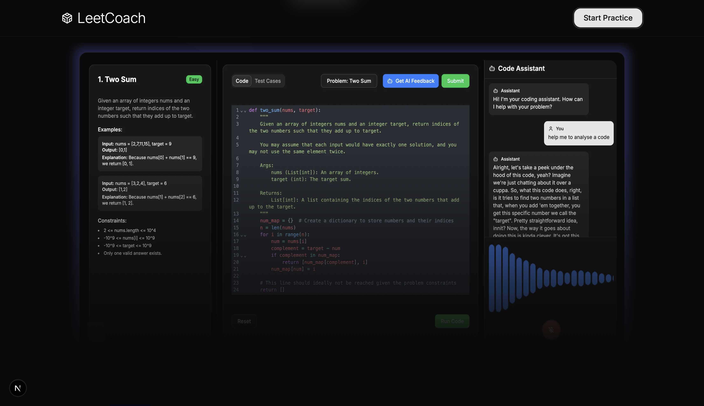

<div align="center">

  <h3 align="center">LeetCoach</h3>

  

  <p align="center">
    AI-powered LeetCode practice tool with real-time feedback and voice-enabled support.
  </p>
  
</div>

## Table of Contents

<details>
  <summary>Table of Contents</summary>
  <ol>
    <li>
      <a href="#about-the-project">About The Project</a>
      <ul>
        <li><a href="#key-features">Key Features</a></li>
      </ul>
    </li>
    <li><a href="#architecture">Architecture</a></li>
    <li>
      <a href="#getting-started">Getting Started</a>
      <ul>
        <li><a href="#prerequisites">Prerequisites</a></li>
        <li><a href="#installation">Installation</a></li>
      </ul>
    </li>
    <li><a href="#acknowledgments">Acknowledgments</a></li>
  </ol>
</details>

## About The Project

LeetCoach is an AI-powered LeetCode companion designed to help users master coding interviews. It provides real-time feedback, personalized guidance, and voice-enabled support to accelerate interview preparation. The application integrates a code editor, problem descriptions, test case evaluation, and an AI assistant to provide comprehensive support throughout the coding practice process.

### Key Features

- **AI-Powered Feedback:** Receive real-time feedback and suggestions on your code using an integrated AI assistant powered by LLMs.
- **Voice Input:** Interact with the AI assistant using voice input for hands-free coding assistance.
- **Code Editor:** Write and edit code directly within the application using a feature-rich code editor with syntax highlighting and code completion.
- **Problem Descriptions:** Access detailed problem descriptions, examples, and constraints to understand the requirements of each LeetCode problem.
- **Test Case Evaluation:** Run your code against a set of test cases and view the results to identify and fix errors.
- **Timer:** Track your progress and time spent on each problem with an integrated timer.
- **Team Section:** Learn about the team behind LeetCoach.

## Architecture

<!--  -->
<div align="center">
  
</div>

The LeetCoach project is structured with a Next.js frontend and a Python backend (codedriver) for code evaluation.

- **Frontend (Next.js):**
    -   Written in TypeScript.
    -   Uses React for UI components.
    -   Employs libraries like `@uiw/react-codemirror` for the code editor, `lucide-react` for icons, and `tailwind-merge` for Tailwind CSS class management.
    -   Includes custom hooks like `useSpeechRecognition` for voice input and `use-mobile` for responsive design.
    -   Communicates with the backend API for code evaluation and AI analysis.
    -   Uses the Neuphonic API for text-to-speech functionality.
- **Backend (codedriver):**
    -   Written in Python using the AIOHTTP framework.
    -   Provides an API endpoint for evaluating user code against test cases.
    -   Implements code execution in a sandboxed environment using `concurrent.futures` and AST parsing for security.
    -   Allows importing of `math` and `typing` modules.
    -   Uses `flake.nix` for managing development dependencies and environment using Nix.

## Getting Started

### Prerequisites

-   Node.js and npm installed for the frontend.
    ```sh
    npm install -g npm@latest
    ```
-   Python 3.x installed for the backend.
-   Nix package manager (optional, for development environment using `flake.nix`).
-   OpenAI API key for AI-powered feedback (set in `.env.local`).

### Installation

1.  **Clone the repository:**

    ```sh
    git clone https://github.com/khoinguyenpham04/shack25neuphonic.git
    cd shack25neuphonic
    ```

2.  **Frontend Setup:**

    -   Navigate to the `frontend` directory:

        ```sh
        cd frontend
        ```

    -   Install dependencies:

        ```sh
        npm install
        ```

    -   Create a `.env.local` file in the `frontend` directory and add your OpenAI API key:

        ```
        OPENAI_API_KEY=your-api-key-here
        NEUPHONIC_API_KEY=your-neuphonic-api-key-here
        ```

    -   Run the development server:

        ```sh
        npm run dev
        ```

3.  **Backend Setup (codedriver):**

    -   Navigate to the `codedriver` directory:

        ```sh
        cd ../codedriver
        ```

    -   Create a virtual environment (optional but recommended):

        ```sh
        python3 -m venv venv
        source venv/bin/activate  # On Linux/macOS
        venv\Scripts\activate  # On Windows
        ```

    -   Install dependencies:

        ```sh
        pip install -r requirements.txt
        ```

    -   Run the backend server:

        ```sh
        python3 server.py -p 3001
        ```

4.  **Access the Application:**

    -   Open your browser and navigate to `http://localhost:3000` to access the LeetCoach application.

## Acknowledgments

-   This project utilizes the Neuphonic API for speech and text-to-speech capabilities.
